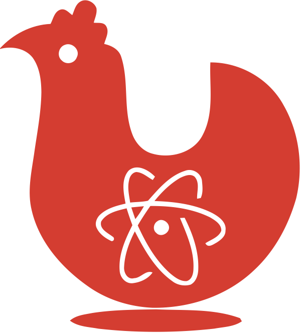

# CoCCA
**Computational Chemistry Calculations Assistant**

## Table of contents

  - [Constrain Generator](#constrain-generator)

## Constrain Generator
It is used to quickly generate input for Quantum Computational software suite (ORCA, XTB, Gaussian) where one or more atoms are being constrained. This is particularly useful for large molecules.
When asked to select the atom indices, insert one or more atom number separed by a space. Also ranges are allowed (e.g.: 110-125, from atom 110 to 125). The enumeration starts from 1.
